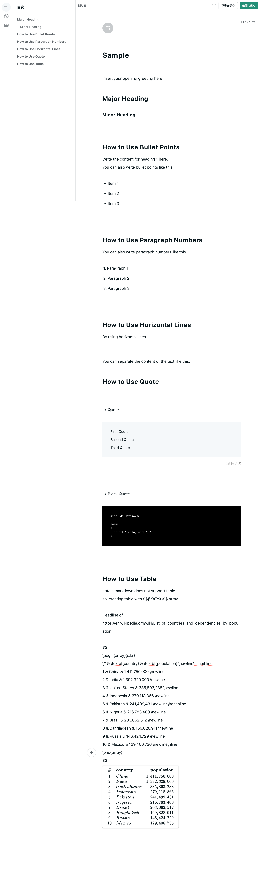

Note Client can automate the posting of articles on note. The content of the articles is written using Markdown notation.  

We are currently releasing a beta version. In the beta version, you can use major headings, minor headings, bullet points, paragraph numbers, and horizontal lines. With future updates, customization such as bold text and quotations as well as the insertion of tables of contents will be available.

Note Client's source code is made available under the [MIT license](https://github.com/Mr-SuperInsane/NoteClient/blob/main/LICENSE).  

[PyPI page](https://pypi.org/project/NoteClient) for this project.

## Documentation

[Japanese](https://note.com/naokun_gadget/n/naf129cb5f34b)

## Requirements

- Python >= 3.7

## Installation

```
pip install NoteClient
```

## Quick Example

```
from Note_Client import Note

EMAIL = 'your email'
PASSWORD = 'your password'
USER_ID = 'your user_id'

TITLE = 'Sample'
CONTENT_PATH = 'content.txt'
TAG_LIST = ['sample_tag']

# > If an image is specified, the index number is entered; if not, no description is given.
# INDEX = 0

# > True if the article is to be published, False if the article is to be saved as a draft; if not specified, the article is saved as a draft.
# POST_SETTING = True

# > True if the execution screen is not displayed, False if it is displayed, or not displayed if not specified.
# HEADLESS = False

# To specify the above three options, add them to the function arguments.

note = Note(email=EMAIL, password=PASSWORD, user_id=USER_ID)
print(note.create_article(title=TITLE, file_name=CONTENT_PATH, input_tag_list=TAG_LIST, image_index=None))

## If successful(Public).
# {'run':'success','title':'Sample','file_path':'content.txt','tag_list':['sample_tag'],'post_setting':'Public','post_url':'https://note.com/USER_ID/n/abc123'}

## If successful(Draft).
# {'run':'success','title':'Sample','file_path':'content.txt','tag_list':['sample_tag'],'post_setting':'Draft'}

## If unsuccessful.
# 'Required data is missing.'
```

## Content File(content.txt)
```
Insert your opening greeting here

## Major Heading
### Minor Heading

## How to Use Bullet Points
Write the content for heading 1 here.
You can also write bullet points like this.

- Item 1
- Item 2
- Item 3

## How to Use Paragraph Numbers
You can also write paragraph numbers like this.

1. Paragraph 1
2. Paragraph 2
3. Paragraph 3

## How to Use Horizontal Lines
By using horizontal lines
---
You can separate the content of the text like this.

## How to Use Quote

- Quote
> First Quote
> Second Quote
> Third Quote

- Block Quote
```
#include <stdio.h>

main( )
{
  printf("hello, world\n");
}
```

## How to Use Table
note's markdown does not support table.
so, creating table with $${\KaTeX}$$ array

Headline of https://en.wikipedia.org/wiki/List_of_countries_and_dependencies_by_population 

$$
\begin{array}{c:l:r}
\# & \textbf{country} & \textbf{population} \newline\hline\hline
1 & China & 1,411,750,000 \newline
2 & India & 1,392,329,000 \newline
3 & United States & 335,893,238 \newline
4 & Indonesia & 279,118,866 \newline
5 & Pakistan & 241,499,431 \newline\hdashline
6 & Nigeria & 216,783,400 \newline
7 & Brazil & 203,062,512 \newline
8 & Bangladesh & 169,828,911 \newline
9 & Russia & 146,424,729 \newline
10 & Mexico & 129,406,736 \newline\hline
\end{array}
$$
```

### Sample


## Help

For inquiries regarding Note Client, please contact [info@mr-insane.net](info@mr-insane.net)
